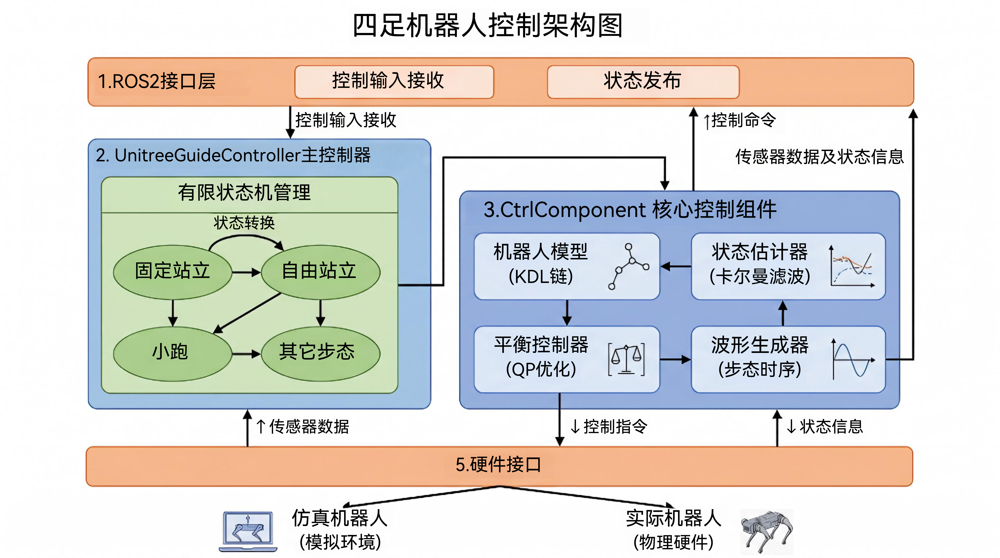

<h1 align="center">Quadruped ROS2 Control</h1>

<p align="center">
  
</p>

<p align="center">
  <em>面向 Unitree Go2 的仿真验证、控制器问题排查与 ROS 2 集成记录。</em>
</p>

<p align="center">
  <strong>简体中文</strong> | <a href="./readme_EN.md">English</a>
</p>

> 这是一份基于原始 `Quadruped ROS2 Control` 项目整理的中文实践说明。当前阶段的修改主要从 `Unitree_guide` 相关部分展开，并结合 `Unitree Go2` 的仿真调试经验持续整理；后续也会逐步扩展到其他控制器的修改与优化。

---

## 分支版本介绍
在继续扩展当前项目之前，这里也想先介绍一下一个很重要的分支版本：[quadruped_ros2_control_unitree_guide `debug` 分支](https://github.com/yanyuze1/quadruped_ros2_control_unitree_guide/tree/debug?tab=readme-ov-file)。这个分支版本对 `unitree_guide` 控制器相关内容做了单独提取，方便更聚焦地查看、调试和分析该部分逻辑；同时也补充了一些可用于 `debug` 的内容，便于在排查问题、观察控制状态和后续优化时更高效地定位关键环节。

## 前言
如果你也在折腾四足机器人控制、仿真和调参，希望这份记录能帮你更快进入状态，也少走一些弯路。感谢项目[Quadruped ROS2 Control](https://github.com/legubiao/quadruped_ros2_control/tree/humble)提供了扎实的基础，本项目正是在它之上继续修改与整理而来，当前使用的是 `Unitree_guide` 分支。后面的内容会围绕真实调试过程中遇到的问题与解决思路展开，希望能让你带着兴趣一路看下去，也能在需要时真正派上用场。
## 项目结构图

## 修改后效果
### 仿真效果


这是在项目修改后的仿真效果。

### 真机测试效果


这是在项目修改后的真机测试效果，但还是可以发现有些小问题。

## 项目修改 
在不改变代码结构的情况下对项目对Unitree Guide控制器部分进行了修改，在使用Unitree Guide控制器进行仿真时会出现两个问题：
### 问题1：Unitree Guide控制器原地旋转受限
#### 1.现象


可以看到机器狗在旋转到一段时间后会进行角度矫正回到原点角度。
#### 2.问题原因： 

原始项目里转向输入本质上被处理成了“不断追踪一个累加的 yaw_cmd_ 角度”，而不是“按一个目标 yaw 角速度持续旋转”。这样一来，控制器在计算姿态误差时：
``` bash
rotMatToExp(Rd * G2B_RotMat) 
```
会总是选择“当前姿态到目标姿态的最短旋转路径”。
所以当机器人持续转到一定角度后，控制器会突然认为“反方向更近”，于是开始输出反向 z 轴角加速度和力矩，看起来就像被矫正回原点
#### 3.问题文件：
* [StateTrotting.h](src/quadruped_ros2_control/controllers/unitree_guide_controller/include/unitree_guide_controller/FSM/StateTrotting.h)
* [StateTrotting.cpp](src/quadruped_ros2_control/controllers/unitree_guide_controller/src/FSM/StateTrotting.cpp)
#### 4.问题解析
问题主要有两层。

1. 把持续转向写成了持续积分 yaw_cmd_
原始思路等价于：
```bash
yaw_cmd_ += d_yaw_cmd_ * dt_;
Rd = rotz(yaw_cmd_);
```
这意味着你不是在告诉机器人“按这个角速度继续转”，而是在告诉机器人“不断去追一个越来越远的朝向”。

2. 姿态误差用的是最短旋转
在 mathTools.h 里，误差是通过：
```bash
rotMatToExp(Rd * G2B_RotMat)
```
得到的。这个表达天然会倾向于“当前姿态到目标姿态的最短旋转路径”。所以当你持续积分 yaw_cmd_ 后，误差到某个姿态区间会突然换符号，控制器就会给出反向的 z 轴角加速度和力矩，看起来就像“旋转到一定角度后自动纠回去”。
#### 5.解决思路
原地持续转向时，应该采用：
* 打杆时：yaw rate control
只控制“转多快”，不再追一个不断累加的绝对 yaw 角度
* 松杆时：yaw hold
把松杆那一刻的当前 yaw 锁住，再进入角度保持

这就是代码里引入 yaw_rate_mode_ 的意义。核心思想只有一句话：

打杆时：只做 yaw rate control，松杆时：再做 yaw hold
#### 6.问题文件修改
1.  在 StateTrotting.h 增加 3 个成员
``` bash
bool yaw_rate_mode_{false};
bool yaw_rate_mode_last_{false};
double yaw_hold_deadband_{0.05};
```
作用：

* yaw_rate_mode_：当前是否处于按角速度转向模式
* yaw_rate_mode_last_：用于判断是否刚从转向模式退出
* yaw_hold_deadband_：避免摇杆微小噪声导致模式抖动切换

2.  在 StateTrotting.cpp 的 enter() 中初始化当前 yaw
``` bash
yaw_cmd_ = estimator_->getYaw();
yaw_cmd_ = std::atan2(std::sin(yaw_cmd_), std::cos(yaw_cmd_));
Rd = rotz(yaw_cmd_);
w_cmd_global_.setZero();

yaw_rate_mode_ = false;
yaw_rate_mode_last_ = false;
```
作用：

* 初始目标朝向就是当前实际朝向
* 刚进入 TROTTING 时不会平白产生一个 yaw 误差

3. 在 getUserCmd() 中把 rx 转成目标 yaw 角速度

当前逻辑保留为：
```bash
d_yaw_cmd_ = -invNormalize(ctrl_interfaces_.control_inputs_.rx, w_yaw_limit_(0), w_yaw_limit_(1));
d_yaw_cmd_ = 0.90 * d_yaw_cmd_past_ + (1 - 0.90) * d_yaw_cmd_;
d_yaw_cmd_past_ = d_yaw_cmd_;
```
作用：

* rx 不再直接控制目标角度
* 而是先变成目标 yaw 角速度 d_yaw_cmd_

4. 在 calcCmd() 中，打杆时不要再累计 yaw_cmd_

保留这样的逻辑：
``` bash
const double current_yaw =
    std::atan2(std::sin(estimator_->getYaw()), std::cos(estimator_->getYaw()));

yaw_rate_mode_last_ = yaw_rate_mode_;
yaw_rate_mode_ = std::fabs(d_yaw_cmd_) > yaw_hold_deadband_;

if (yaw_rate_mode_) {
    yaw_cmd_ = current_yaw;
} else if (yaw_rate_mode_last_) {
    yaw_cmd_ = current_yaw;
}

Rd = rotz(yaw_cmd_);
w_cmd_global_.setZero();
w_cmd_global_(2) = d_yaw_cmd_;
```
这一步最关键。

修改前的问题写法等价于：
``` bash
yaw_cmd_ += d_yaw_cmd_ * dt_;
```
修改后的意思是：

* 当用户正在转向时，yaw_cmd_ 不再继续积分增长
* yaw_cmd_ 直接锁在当前实际 yaw
* 这样姿态控制器不会再制造额外的 yaw 角位置误差
* 机器人只通过 w_cmd_global_(2) 去跟踪角速度
* 松杆后再执行：
```bash
yaw_cmd_ = current_yaw;
```
这样就把松杆那一刻的朝向锁住，之后进入朝向保持

5. 在 calcTau() 中，yaw-rate 模式下关闭 yaw 位置误差
```bash
Vec3 rot_error = rotMatToExp(Rd * G2B_RotMat);
if (yaw_rate_mode_) {
    rot_error(2) = 0.0;
}
```
作用：

* rot_error(2) 是 yaw 姿态误差
* 有持续转向输入时，不应该再让控制器追 yaw 角度误差
* 否则即使前面不再积分 yaw_cmd_，后面依然可能产生“往回拉”的力矩

6. d_wbd 使用修改后的 rot_error

``` bash
Vec3 d_wbd = kp_w_ * rot_error +
             Kd_w_ * (w_cmd_global_ - estimator_->getGyroGlobal());
```
作用：
* 将修改后的姿态误差直接作用在计算中
### 问题2：Unitree Guide控制器坐标系
#### 1.现象


可以看到机器狗在旋转到大约1.57rad左右时会失去平衡而导致摔倒，如果观测debug图可以清晰的看到力矩的突变出现。

#### 2.问题原因： 

* 估计器里足端位置/速度观测的坐标系不一致：

在 Estimator.cpp  和 Estimator.cpp ，代码把机体系的足端相对位置、相对速度直接塞进观测量；但 Estimator.cpp的观测矩阵 C 实际假设的是世界系相对量。
* yaw≈0 时这个问题不明显，但旋转到 1.57 rad 时问题就出现了：

当 yaw≈1.57 rad 接近 pi/2 时，body/world 轴几乎错开 90 度，误差接近最大，所以会在这个绝对朝向附近稳定触发。
* 摆动腿速度反馈用了错的世界系速度：

在 Estimator.h，getFeetVel() 把机体系 J*qdot 直接加到世界系机身速度上，缺少 R 旋转，且也缺少 omega x r 项。于是摆动腿阻尼方向会随绝对 yaw 增大越来越偏，转到约 1.57 rad 时最容易把腿打到错误方向。

```bash
绝对 yaw 接近 1.57 rad左右
-> 足端位置/速度观测的坐标系错误被放大
-> 摆动腿速度反馈方向错误
-> 摆动腿虚拟力打错方向
-> 机身开始横摆/侧倾
-> QP 平衡控制进入补救
-> yaw 力矩出现正负跳变
-> 最终摔倒
```
#### 3.问题文件
* [Estimator.h](src/quadruped_ros2_control/controllers/unitree_guide_controller/include/unitree_guide_controller/control/Estimator.h)
* [Estimator.cpp](src/quadruped_ros2_control/controllers/unitree_guide_controller/src/control/Estimator.cpp)
* [StateTrotting.cpp](src/quadruped_ros2_control/controllers/unitree_guide_controller/src/FSM/StateTrotting.cpp)

#### 4.问题解析

1. 主因是估计器把机体系足端观测当成了世界系观测。
文件在 Estimator.cpp 和 Estimator.h。

2. Estimator.cpp 中 update() 里，foot_poses_ 和 foot_vels_ 来自腿部运动学，本质上是机体系量，但后续观测矩阵 C 对应的模型却要求它们是世界系相对量。
也就是说，当前观测模型和观测数据不在同一个坐标系。

3. Estimator.h 中 getFeetVel() 直接做了：
```bash
result.col(i) = Vec3(feet_vel[i].data) + getVelocity();
```
这里把机体系 J*qdot 直接加到世界系机身速度上，少了两个关键项：
```bash
R * (...)
omega x r
```
4. 当 yaw ≈ 0 时，body/world 方向差不大，所以问题不显著；当 yaw ≈ 1.5 rad 时，body x/y 与 world x/y 几乎错开 90°，这个错误就会逼近最大，于是形成“到固定绝对朝向就倒”的稳定现象。

#### 5.解决思路
1. 修复估计器中的足端观测坐标系，让足端相对位置、相对速度进入滤波器前统一到世界系。
2. 修复 getFeetVel()，让 swing 腿控制使用真正的世界系足端速度。
3. 修复 yaw_rate_mode_ 下的姿态控制逻辑，真正关闭 yaw 绝对角位置误差，只保留 yaw 角速度控制。

#### 6.问题文件修改

1. Estimator.h 中 getFeetVel()进行修改

问题：

* robot_model_->getFeet2BVelocities() 返回的是机体系足端相对机身速度。
* 当前代码把它直接当世界系速度用了。
* 正确的世界系足端速度应满足：
```bash
v_foot_world = v_body_world + R * (omega_body x r_body + v_rel_body)
```
将 getFeetVel() 替换为：
```bash
Vec34 getFeetVel() {
    const std::vector<KDL::Vector> feet_vel_body_list = robot_model_->getFeet2BVelocities();
    const std::vector<KDL::Frame> feet_pos_body_list = robot_model_->getFeet2BPositions();
    Vec34 result;
    const Vec3 body_vel_world = getVelocity();

    for (int i(0); i < 4; ++i) {
        const Vec3 foot_pos_body = Vec3(feet_pos_body_list[i].p.data);
        const Vec3 foot_vel_body = Vec3(feet_vel_body_list[i].data);

        // [修改1]
        // 足端世界速度 = 机身世界速度 + R * (omega x r + v_rel_body)
        result.col(i) = body_vel_world +
                        rotation_ * (gyro_.cross(foot_pos_body) + foot_vel_body);
    }
    return result;
}
```
为什么这样改：

* foot_vel_body 只是腿在机体系里的相对速度。
* 机器人自身转动时，足端还会额外产生 omega x r 项。
* 最后必须乘 rotation_ 才能从机体系转到世界系。
* 这一步修好后，摆动腿 PD 的速度误差方向就不会在绝对 yaw≈1.5 rad 时严重失真。
2. 修复 Estimator.cpp 中 update() 的观测构造

问题：

* 代码先拿到 foot_poses_ 和 foot_vels_，随后直接塞进 feet_pos_body_、feet_vel_body_。
* 这些量本质是机体系量，但卡尔曼滤波的 C 矩阵对应的是世界系相对观测。
* 所以这里需要先读取 IMU 姿态和角速度，再做转换。
建议把 update() 中“读取 IMU + 生成观测量”的这部分按下面替换。

原本代码：
```bash
foot_poses_ = robot_model_->getFeet2BPositions();
foot_vels_ = robot_model_->getFeet2BVelocities();
feet_h_.setZero();

for (...) {
    ...
    feet_pos_body_.segment(...) = Vec3(foot_poses_[i].p.data);
    feet_vel_body_.segment(...) = Vec3(foot_vels_[i].data);
}

Quat quat;
...
rotation_ = quatToRotMat(quat);

gyro_ << ...
acceleration_ << ...
```
改成：
``` bash
foot_poses_ = robot_model_->getFeet2BPositions();
foot_vels_ = robot_model_->getFeet2BVelocities();
feet_h_.setZero();

// [修改2]
// 先读取 IMU 姿态和角速度，因为后面的足端观测要统一转换到世界系
Quat quat;
quat << ctrl_interfaces_.imu_state_interface_[0].get().get_value(),
        ctrl_interfaces_.imu_state_interface_[1].get().get_value(),
        ctrl_interfaces_.imu_state_interface_[2].get().get_value(),
        ctrl_interfaces_.imu_state_interface_[3].get().get_value();
rotation_ = quatToRotMat(quat);

gyro_ << ctrl_interfaces_.imu_state_interface_[4].get().get_value(),
        ctrl_interfaces_.imu_state_interface_[5].get().get_value(),
        ctrl_interfaces_.imu_state_interface_[6].get().get_value();

acceleration_ << ctrl_interfaces_.imu_state_interface_[7].get().get_value(),
        ctrl_interfaces_.imu_state_interface_[8].get().get_value(),
        ctrl_interfaces_.imu_state_interface_[9].get().get_value();

for (int i(0); i < 4; ++i) {
    if (wave_generator_->contact_[i] == 0) {
        Q.block(6 + 3 * i, 6 + 3 * i, 3, 3) = large_variance_ * Eigen::MatrixXd::Identity(3, 3);
        R.block(12 + 3 * i, 12 + 3 * i, 3, 3) = large_variance_ * Eigen::MatrixXd::Identity(3, 3);
        R(24 + i, 24 + i) = large_variance_;
    } else {
        const double trust = windowFunc(wave_generator_->phase_[i], 0.2);
        Q.block(6 + 3 * i, 6 + 3 * i, 3, 3) =
                (1 + (1 - trust) * large_variance_) *
                QInit_.block(6 + 3 * i, 6 + 3 * i, 3, 3);
        R.block(12 + 3 * i, 12 + 3 * i, 3, 3) =
                (1 + (1 - trust) * large_variance_) *
                RInit_.block(12 + 3 * i, 12 + 3 * i, 3, 3);
        R(24 + i, 24 + i) =
                (1 + (1 - trust) * large_variance_) * RInit_(24 + i, 24 + i);
    }

    const Vec3 foot_pos_body = Vec3(foot_poses_[i].p.data);
    const Vec3 foot_vel_body = Vec3(foot_vels_[i].data);

    // [修改2-1]
    // 观测位置改成世界系下“足端相对机身的位置向量”
    feet_pos_body_.segment(3 * i, 3) = rotation_ * foot_pos_body;

    // [修改2-2]
    // 观测速度改成世界系下“足端相对机身速度”
    feet_vel_body_.segment(3 * i, 3) =
            rotation_ * (gyro_.cross(foot_pos_body) + foot_vel_body);
}
```
为什么这样改：

* feet_pos_body_ 虽然变量名里带 body，但送入 y_ 之后，它应当满足观测矩阵 C 的数学含义，所以必须是世界系相对位置。
* feet_vel_body_ 同理，必须是世界系相对速度，否则滤波器会把错误观测当真，导致 x_hat_ 在绝对 yaw≈1.5 rad 时系统性失真。
* 这里先读 IMU 再做转换，是因为 rotation_ 和 gyro_ 都参与变换。

## 后言
上面就是这次的问题修改内容，卡了很久，终于找到原因了。要哭了😎，希望以后遇到类似问题时能快速定位。真机部署部分还有一定的问题，等我修改后一起解决，后面也会单独把Unitree_guide的ros2版本单独提炼出来提供给各位使用，也会慢慢去添加到老版本的仿真中，让我们开始强化学习和agent之路！笑出强大！


## 飞书仓库
虽然我不懂，但我一定会跟你说加油，努力一下。


